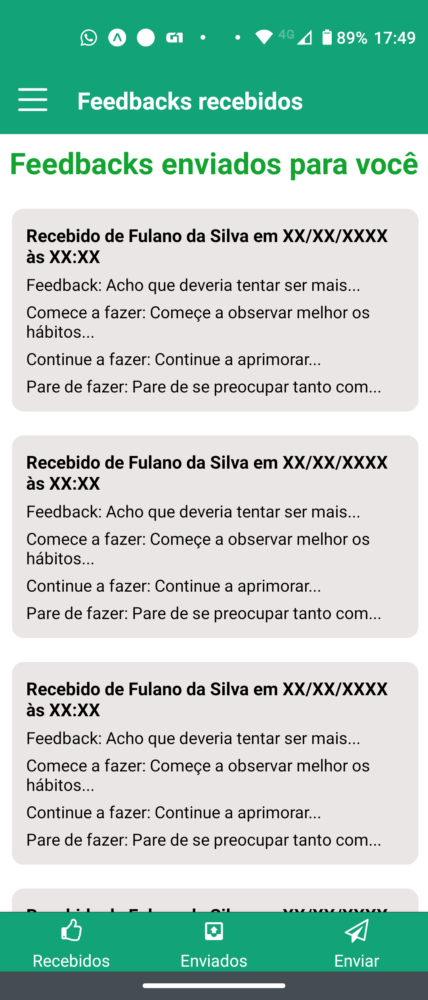
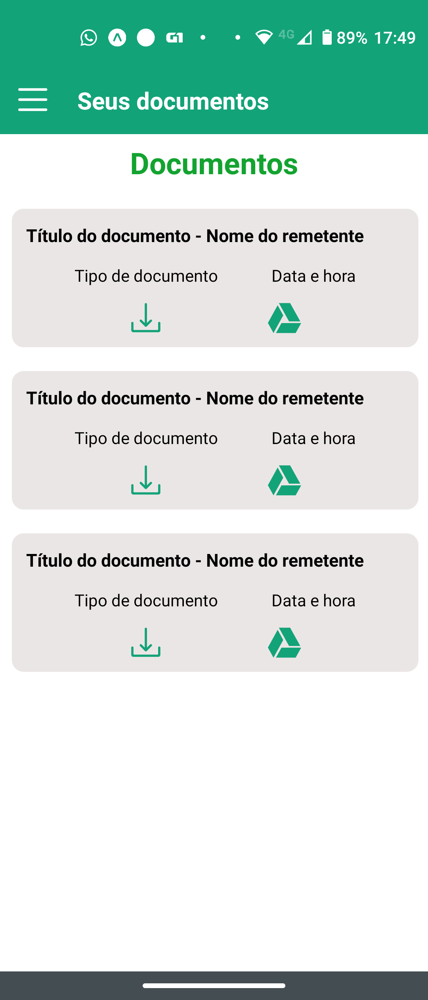
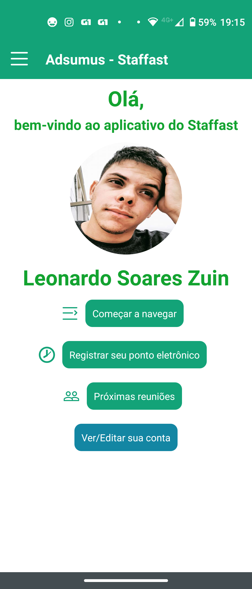

# Aplicativo do Staffast
O aplicativo do Staffast foi feito com o objetivo de disponibilizar algumas das funcionalidades do sistema Staffast para a web em forma de aplicação 
para dispositivos móveis, a fim de aprimorar a experiência do usuário. O sistema Staffast para a web também tem parte do seu código fonte 
disponível aqui no GitHub. Vale observar que o projeto foi feito com o Expo. Ao fim deste texto, deixei algumas imagens para demonstração.

## Principais tecnologias utilizadas
* React Native: foi a tecnologia selecionada para o desenvolvimento deste projeto
* React Navigation versão 5: foi feito uso de Drawer Navigator e Tab Navigator
* AsyncStorage: utilizado para reservar o token de autenticação da API do usuário
* React Redux: usado em algumas funcionalidades para atualização em tempo real quando informações são enviadas

## *Back-end*
O *backend* do projeto foi feito em PHP, pelos seguintes motivos:
* O sistema Staffast para web já possui dimensões grandes com programação orientada a objeto
* O tempo necessário para desenvolver um *backend* usando outra tecnologia seria muito maior do que apenas desenvolver funções 
dentro do sistema web para receber as requisições
* O objetivo deste projeto é o de aprimorar habilidades com o React Native, portanto economia de tempo com o *backend* significa 
mais tempo para o crescimento do conhecimento com o React Native

## Funcionalidades
* Autenticação de usuário
* Registro de ponto eletrônico de funcionários
* Histórico de ponto eletrônico pessoal
* Tabela dos horários de trabalho e condições
* Feedbacks (visualizar recebidos, enviados e enviar um novo)
* Documentos
* Reuniões (visualizar as para hoje, as próximas e as anteriores, podendo confirmar ou revogar presença)
* Notificações *push*

### Registro de ponto eletrônico
O registro de ponto eletrônico ocorre através de um toque em uma das 4 opções na tela. O usuário pode inserir uma observação, se quiser. O 
aplicativo coleta as coordenadas do dispositivo e envia para a API, que converte as coordenadas em endereço legível usando API da Google.

O histórico de pontos exibe os últimos registros feitos, bem como os endereços e obervações escritas pelo usuário.
A tabela de condições e horários exibe informações como tolerância de atraso, horário flexível, entre outros.

### Feedbacks
A funcionalidade de feedbacks foi inspirada em ferramenta parecida disponível na plataforma da Qulture.Rocks, empresa que possui um sistema de 
avaliação de funcionários parecido com o meu projeto. Qualquer pessoa pode enviar um feedback para qualquer pessoa e usar algumas pré definições
como "deveria começar/continuar/parar de fazer..."

Esta funcionalidade faz uso do **redux** para atualizar a lista de feedbacks enviados no momento em que o usuário envia um novo feedback.

### Reuniões
Uma tela única e simples, onde se distribuem _cards_ para exibir as reuniões.

### Documentos
Por motivo de segurança, o usuário é redirecionado para o *browser* para realizar tarefas de autenticação antes de poder baixar um documento 
que esteja disponível para o mesmo.

### *Push Notifications*
Quando um usuário recebe um novo feedback ou quando o ponto eletrônico é registrado com sucesso, uma notificação *push* é enviada para o dispositivo do usuário.
Esta funcionalidade foi desenvolvida utilizando o *expo-notifications*

## Imagens de demonstração

